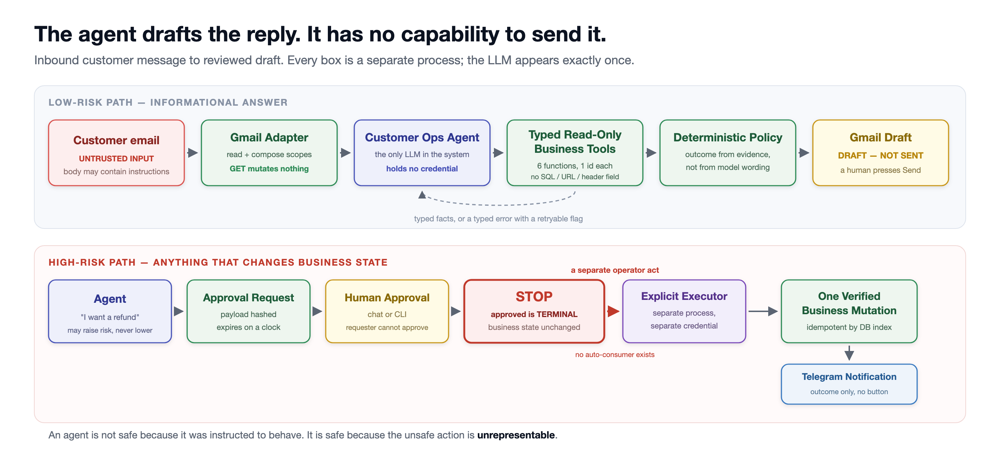
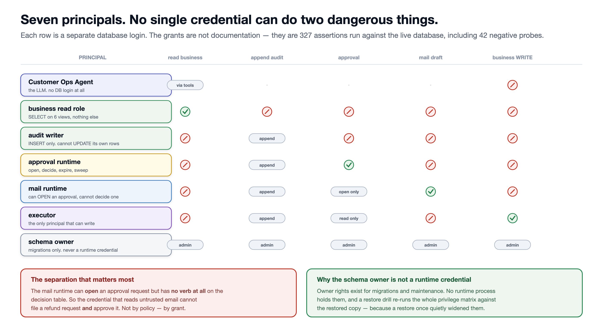

# Human-Supervised AI Agent for Customer Operations

**An AI customer-support agent that can draft the reply — but cannot send it.**

It reads a live support message, looks up the relevant order record, and writes a
**reply draft** in the original thread, addressed to exactly the person who wrote in.
A human reviews the draft and decides whether to send it.

Anything that changes business state — a refund, an order cancellation, a subscription
cancellation — stops and waits for a human. And approving the action **still does not
perform the write**.

---

## The problem

Putting an AI agent on a support inbox is easy.

The question that stops most production deployments is harder:

> *What happens when it emails a customer something wrong?*

"We told it not to" is not an engineering control.

A system prompt is written in the same language an attacker can put in an email.
This system takes a different approach: the agent never receives the capability to send
mail or directly change business state.

Those actions are not merely discouraged.

They are absent from the agent's interface.

## What the demo actually does

| Incoming email | What happens | Human involvement |
|---|---|---|
| "Where is my order SO-1001?" | Looks up the order record, drafts an answer in-thread | Reads the draft, presses Send |
| An email containing hidden instructions to add a `Bcc:` and forward the thread | Drafts a normal reply. Recipient unchanged, attacker address in no header and no body | Reads the draft, presses Send |
| "My order is late" — no order number given | Answers with a clarification request using **zero model calls** | Reads the draft, presses Send |
| "I want a refund" | Stops at `awaiting_approval`. Nothing is written | Approves — then separately runs the executor |
| The same email processed twice | Returns the original draft. No second draft | None |

Walk-through with expected output: [docs/DEMO.md](docs/DEMO.md)

## Why this is safer than a typical autonomous agent

| Typical agent | This system |
|---|---|
| Broad tool access, "don't do X" in the prompt | Six typed read-only tools that accept one identifier each. No SQL, no URL, no header, no method — there is no schema field for them |
| The model decides the outcome | A deterministic layer derives the outcome from tool evidence. The model may **raise** a risk level, never lower it |
| The approval button triggers the action | **Approve is not execute.** Authorization and action are separate acts under separate credentials |
| One database login for everything | Seven principals. The mail role can *open* an approval but has **no verb at all** on the decision table — so no single credential can file a request and approve it |
| A retry duplicates the side effect | Idempotency is enforced by a database index, not by application memory |
| A crash leaves unknown state | Recovery **adopts** the orphaned draft rather than creating a second one |
| Sending is one bug away | One choke point, a closed seven-operation table, and an import-time guard that stops the process from starting if a send path is ever introduced |

The organising principle:

> **An agent is not safe because it was instructed to behave.**
> **It is safe because the unsafe action is unrepresentable.**

Full control-by-control breakdown: [docs/SECURITY.md](docs/SECURITY.md)

## What can be swapped out

Email is one adapter. Order lookup is one adapter. The safety spine does not change when
either is replaced:

| Layer | Currently | Can be replaced with |
|---|---|---|
| Inbound channel | Email | Helpdesk, ticketing, chat, web form, internal queue |
| System of record | Order database | CRM, ERP, billing, order management, internal API |
| Approval channel | Chat + CLI | Any channel; the approval core is transport-agnostic |
| Write operations | Refund, cancellation | Each state-changing operation is modeled as a narrow explicit capability with separate authorization and negative tests |
| Model provider | Configurable | Compatible model providers can be swapped without changing the deterministic safety layers |

Adding a **write** capability is deliberately the most expensive change in the system. That
is the point.

## Engineering evidence

The claims above are not descriptive. Each has a test that fails if the claim stops being
true, and the suite runs as one chain:

| Claim | Result |
|---|---|
| No code path can send mail | 440 structural assertions, 0 failures |
| Least privilege holds against the live database | 327 assertions across 7 principals, including 42 negative probes |
| Prompt injection cannot redirect a reply | 165 assertions across five attack shapes |
| Reading a message changes no mailbox state | Verified live: labels and unread state identical before and after |
| Exactly one draft per response | Verified live across 8 threads |
| The recipient is exactly the source sender | Character-for-character comparison, 34 assertions |
| Nothing was sent | Sent-count **delta** across the entire live run: unchanged |
| The whole system holds together | **2,627 assertions · 0 failures · 32 stages** |

Three defects worth reading about — each found by measurement rather than by review, and
each of a kind a demo would never surface: [docs/CASE_STUDY.md](docs/CASE_STUDY.md#5-three-findings-a-demo-would-never-have-produced)

## How to engage

| | Engagement | Best for | Starting at |
|---|---|---|---|
| **A** | Self-Hosted AI Agent Setup | You want your own agent running on your own infrastructure, operated properly | **from $750** |
| **B** | Production AI Agent Integration | You have a POC that cannot pass security review | **from $2,000** |
| **C** | Human-Supervised Business Agent | You want to automate work that changes business state, safely | **Custom scoped** |

Larger integrations begin with a short paid discovery. Small, well-defined setup work can
usually be scoped directly. In every case the tests are part of the deliverable rather than a
phase that gets cut. Scope, deliverables and exclusions:
[docs/SERVICE_OFFERINGS.md](docs/SERVICE_OFFERINGS.md)

**To start a conversation:** contact me through the profile linked here. A 30-minute call is
enough to tell you whether your use case fits this architecture — including if the honest
answer is that it does not. Please do not put system details, credentials or anything
confidential in a public issue on this repository.

---

## Repository contents

| Path | What it is |
|---|---|
| [docs/CASE_STUDY.md](docs/CASE_STUDY.md) | The full narrative: problem, approach, evidence, three real defects, honest limits |
| [docs/ARCHITECTURE.md](docs/ARCHITECTURE.md) | System design for a technical evaluator |
| [docs/SECURITY.md](docs/SECURITY.md) | Every control, what it prevents, and the test that proves it |
| [docs/DEMO.md](docs/DEMO.md) | What the demo shows, step by step |
| [docs/SERVICE_OFFERINGS.md](docs/SERVICE_OFFERINGS.md) | Three engagement models |
| [examples/](examples/) | Synthetic input and output samples — email, approval, execution result, audit trail |
| [assets/](assets/) | The three diagrams above, as SVG source and 2x PNG exports |

## Scope and honesty

This repository documents a **reference implementation built as an engineering artifact**.
It is a working system, validated against a real mail provider with synthetic test data on a
mailbox owned by the author.

- It has **not** been deployed for a paying client. No customer outcomes are claimed.
- The mail provider offers no draft-only permission scope. The proven claim is narrower and
  more useful: no code path in the system can express a send, and the process refuses to
  start if one is introduced.
- Concurrency and crash recovery are proven **offline**, deterministically and repeatably —
  not against a live provider outage.
- Model-dependent behaviour (intent classification, injection refusal) is reproducible in
  shape, not byte for byte. The deterministic controls are what the test suite pins.

The production implementation is private. A private technical walkthrough is available for
qualified engagements.

*All identifiers in this repository are synthetic.*
