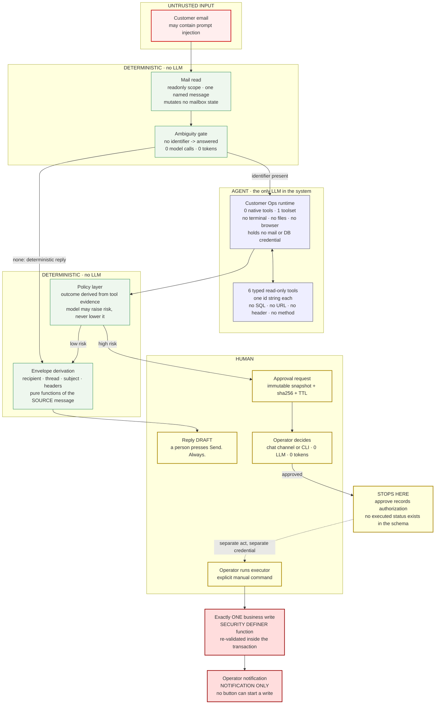
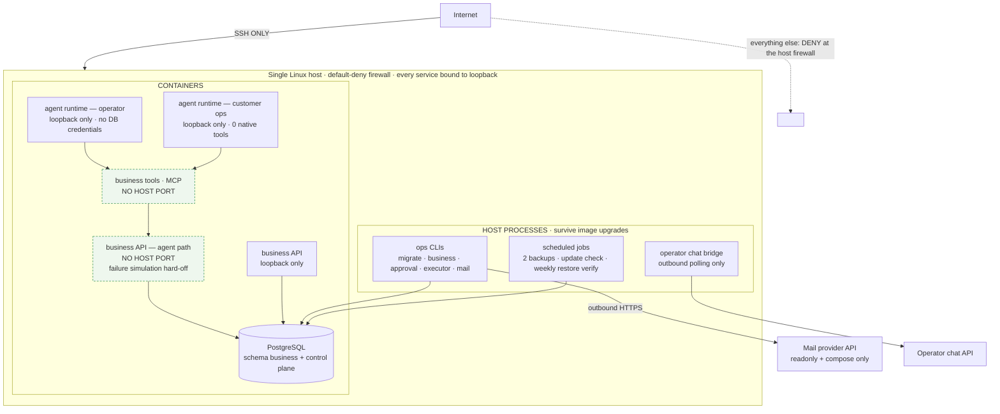
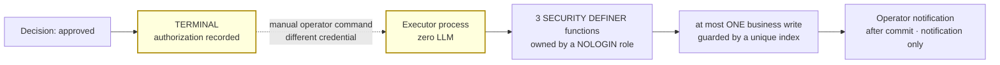
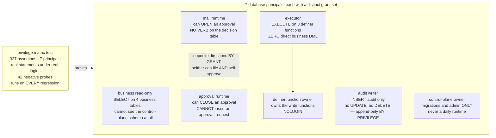
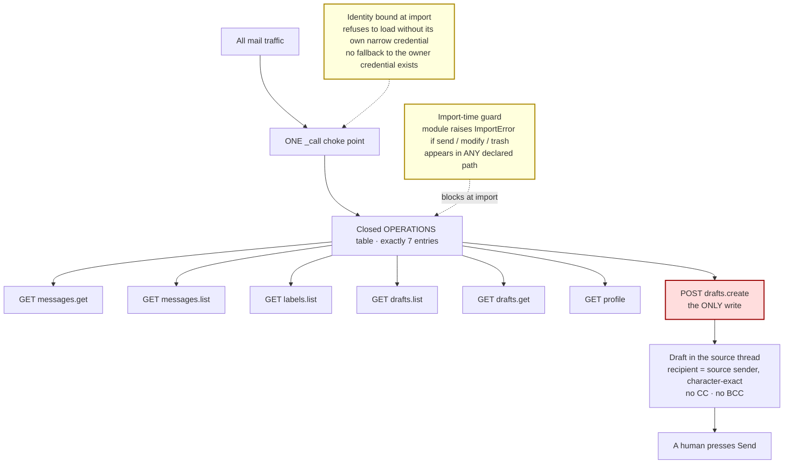
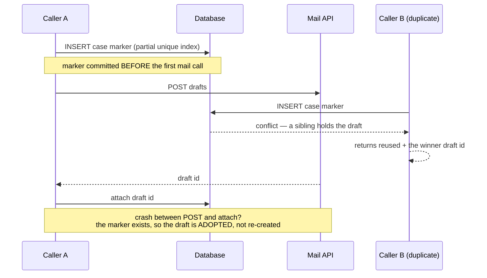

# Architecture

For a technical evaluator. No project history, no sprint numbering — the system as it
stands, and the reasoning behind each boundary.

---

## 1. What the system is

A self-hosted, human-supervised LLM agent platform that handles inbound customer email.
It reads a message, retrieves the system-of-record data behind it, decides an outcome from
measured evidence, and produces a **reply draft**. Anything that changes business state stops
and waits for a human — and the human decision **still does not perform the write**. A
separate, separately-credentialed operator action does.

The design centre is a single sentence:

> The LLM sits in the middle of the pipeline and touches nothing on either edge.

It holds no mail credential and no database credential. It contributes an intent and body
text. Every other field — recipient, thread, subject, headers, risk tier, disposition — is
computed by deterministic code from the source message and from tool evidence.

## 2. Component map

Read it as three claims:

1. The LLM never holds a credential and never fills an envelope field.
2. Every arrow that leaves the system passes through a **human**.
3. `approved` is a **terminal state**. The dotted line is a separate operator act under a
   separate credential — there is no automatic consumer of approved decisions.

## 3. Runtime topology

Nothing is reachable from the internet except SSH. Operator access to any internal API is
over an SSH tunnel. The two components on the agent data path have **no host port at all** —
not even a loopback one.

The control plane runs on the host, outside the agent image, so upgrading the agent runtime
cannot break migrations, approvals, execution, backups or the operator channel.

## 4. The agent boundary

The customer-ops runtime is a second, dedicated instance of the agent framework, narrowed
from the default 15 toolsets and 38 native tools to **1 toolset and 0 native tools**. No
terminal, no filesystem, no browser, no arbitrary HTTP, no scheduler.

Its entire reach into the business is six typed read-only tools:

| Tool | Argument | Returns |
|---|---|---|
| `customer_lookup` | one customer id | customer record |
| `customer_orders` | one customer id | that customer orders |
| `customer_subscriptions` | one customer id | that customer subscriptions |
| `order_lookup` | one order id | order record |
| `shipment_lookup` | one shipment id | shipment record |
| `subscription_lookup` | one subscription id | subscription record |

Each schema declares exactly one string property with an anchored pattern, and
`additionalProperties: false`. There is **no field** for SQL, a URL, a path, an HTTP method,
a header, a timeout or a retry count — so those are not filtered, they are
**unrepresentable**. Unknown keys are rejected rather than ignored. Invalid ids are refused
before any I/O and are never echoed back into a model-visible string.

Errors are classified at our own boundary into a typed taxonomy with an explicit `retryable`
flag. A business answer such as "no such order" is a **result**, not a transport failure —
a distinction that matters because the framework tool client opens a circuit breaker after
three consecutive error results. See finding 5.1 in the case study.

## 5. The deterministic disposition layer

The model does not decide what happened. Raw tool frames are parsed into an **evidence
ledger**, and the outcome is derived from that ledger:

- If the model asserts a fact with no supporting tool evidence, the run is rejected.
- The model may make an outcome **more** cautious. It can never make it less.
- A draft whose content contradicts the evidence is replaced by a deterministic reply.
- A draft is produced only when the grounding verdict and the draft verdict are both
  exactly `True` and the agent status is terminal-valid. A missing verdict fails closed.

Ahead of the model there is an **ambiguity gate**: mail with no usable identifier is answered
deterministically with **0 model calls and 0 tokens**. Cost control becomes an architectural
property rather than a budget alarm.

## 6. Approval, and why it is not execution

A high-risk intent produces an approval request carrying an **immutable snapshot** of the
entity state, a canonical-JSON sha256 of that snapshot, and a TTL.

When a human decides, the snapshot is rebuilt and compared **inside the deciding
transaction**. If the world moved, the decision is refused. A unique constraint on the
approval id makes a second decision impossible. There is **zero LLM** in the decision path.

And then it stops. There is no `executed` status in the schema and no code path from a
decision to a business table. Execution is a separate program, run by an operator, under a
different database login:

The executor login holds **zero direct DML** on business tables. Its only capability is
`EXECUTE` on three narrow functions. Those functions accept the operations the business
actually authorizes and nothing else — so an unrelated mutation such as changing a customer
address is not blocked by a check, it is **unrepresentable**: no function accepts one.

## 7. Privilege model

Every runtime has its own identity, granted **per verb and per column**, deny by default.
The control-plane owner credential is used for migrations, role setup and operator
maintenance only — no daily runtime path uses it.

The mirror-image pairing of the mail runtime and the approval runtime is the sharpest
control in the system. A write-shaped email genuinely *is* a request a human must decide, so
the mail runtime must be able to INSERT an approval request. It therefore holds **no verb at
all** on the decision table, while the approval runtime can write a decision and cannot
INSERT a request. Separation of duties becomes a database fact instead of a call-graph
convention.

Runtime identity is bound at **import time** from a dedicated connection string. A workflow
imported without its own credential exits instead of falling back to a broader one.

## 8. Mail capability boundary

Scopes requested are exactly read-only and compose. Nothing else.

**Stated honestly:** the provider offers no draft-only scope, so the compose token is
technically capable of sending. The proven claim is narrower and stronger than a promise —
*no code path in this system can express a send* — and 440 structural assertions plus the
import-time guard fail loudly the moment one could.

## 9. Idempotency and the crash window

Proven live: reprocessing an already-handled message produced **no second draft** — 8
threads, exactly one draft each. Proven offline: a 20-way executor race yields exactly one
write, and a crash in the mutation window reconciles without ever double-mutating.

## 10. Data model, in outline

| Schema | Contents | Who can touch it |
|---|---|---|
| business | Synthetic customers, orders, shipments, subscriptions. 24 CHECK constraints carrying the domain invariants; fixed-time fixtures so tests do not decay. | The read-only role reads. Writes exist only inside definer functions. |
| control plane | Tasks and their state machine, approval requests and decisions, execution records, append-only audit, model usage and cost. | Per-runtime roles, granted per verb and per column. |

Schema changes go through forward-only, checksum-guarded migrations — 18 of them — and a
clean-database run from the first migration reproduces an identical dataset hash.

## 11. Operational properties

| Property | How it is handled |
|---|---|
| Config | Externalized; secrets delivered out of band, never in version control |
| State | Persistent volumes; the database is the single source of truth |
| Backups | Two scheduled backups; a **weekly automated restore verification**, not just a dump |
| Upgrades | Pinned image tags and digests; an update monitor reports drift rather than auto-applying |
| Restart safety | Every service restart-safe; host reboot tested |
| Observability | Deterministic status command over the operator channel; audit rows rather than log prose |
| Cost | Token and cost accounting per run; pricing table decoupled from task logic |

## 12. What the architecture can absorb next

| Extension | Fits because |
|---|---|
| A different inbound channel — helpdesk, ticketing, chat, web form | The mail transport is one adapter behind a deterministic pipeline |
| A different system of record — CRM, ERP, billing, order management | The tool boundary is six typed read-only functions over a data source |
| More business write operations | Each is one narrow definer function plus one grant plus one privilege assertion |
| Additional approval channels | The decision path has no LLM in it and is already CLI plus chat |
| Auto-send for specific low-risk intents | Would be a deliberate, reviewed capability change with its own evidence — the current boundary is a closed operation table, and widening it is visible in the diff |
| Multi-tenant or multi-mailbox operation | Identity is bound per runtime at import; adding a runtime adds a credential, not a code path |

## 13. Explicit non-goals

- **No auto-send.** A human presses Send.
- **No automatic consumption of approved decisions.** Approval is authorization; execution is
  a separate operator act.
- **No agent-authored SQL, URLs, or shell.** Not filtered — unrepresentable.
- **No horizontal scale-out** in this deployment. It is a single-host reference system;
  the patterns are topology-independent, and a real deployment would be sized to real load.
- **No real customer data anywhere.** The business dataset is synthetic and constrained to be.

---

*Database principals are described here by function. Hostnames, addresses, ports,
filesystem paths, account identifiers and credentials are omitted deliberately.*
